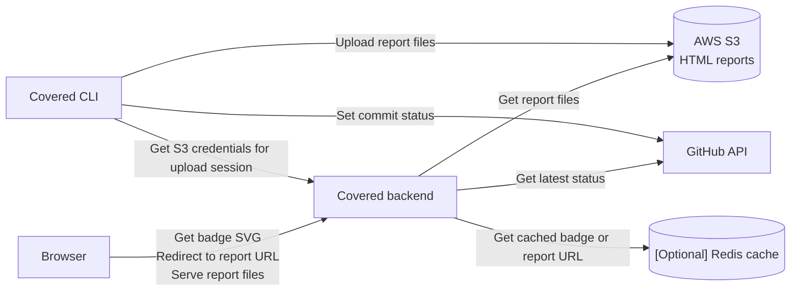

<p align="center">
<br />
<b>Make it green.</b>
</p>

<p align="center">
<a href="https://github.com/YuriiMotov/covered/actions?query=workflow%3ATest+event%3Apush+branch%3Amaster">
    
</a>
<a href="https://coverage-0cc8740f.fastapicloud.dev/badge/redirect/YuriiMotov/covered/">
    
</a>
</p>

# Covered

Self-hosted coverage report hosting for GitHub repositories — an alternative to Smokeshow, Codecov, and Coveralls for teams that prefer to keep their coverage data in-house and overcome limitations.

**Covered** has two parts:

- A **FastAPI backend** that stores HTML coverage reports, serves them over HTTP, and exposes an SVG badge.
- A **CLI** that runs in CI, uploads the report, posts a `covered` commit status to GitHub, and refreshes the badge cache.

## Architecture

Here is a [a bit simplified] diagram of how the components interact:



CLI requests temporary credentials from the backend to upload the report to S3, uploads the report, then sets a `covered` status on the commit.

When reader opens the page that contains badge, the badge is loaded from the backend, which looks up the latest `covered` status for the default branch commit, finds the corresponding coverage value, and serves the badge SVG. The badge links to the report URL, which is also served by the backend.

Optional Redis caching can be used to reduce latency and GitHub API calls for frequently accessed badges.

After uploading a report on the default branch, the CLI can also trigger a cache purge (if `-purge-cache` is specified) to ensure the badge reflects the new coverage value as soon as possible.

## Getting started

Setting up Covered takes two steps:

1. **Deploy the backend** — provision S3, Redis, and a GitHub token, then deploy to FastAPI Cloud. See [backend/README.md](backend/README.md).
2. **Wire up CI** — add the `covered` CLI to your test workflow. See the [GitHub Action setup](#github-action-setup) below; full CLI options are in [cli/README.md](cli/README.md).

## GitHub Action setup

In CI, coverage is uploaded by the [`covered` CLI](cli/README.md), which is published to PyPI. After your test job generates an HTML coverage report (typically `htmlcov/`), the CLI uploads it to your backend, posts a `covered` commit status on the commit, and refreshes the badge cache (if configured).

### Workflow setup

Before adding the workflows, make sure:

- **The backend is deployed and reachable** — see [backend/README.md](backend/README.md).
- **Your project uses `uv` with a committed `uv.lock`.** The workflows install dependencies via `uv sync --locked`.

Covered's CLI runs in a **separate workflow** that triggers after your test workflow finishes. This split is what makes coverage work for pull requests from forks: a fork's workflow can't read your `COVERED_API_KEY` secret and can't post commit statuses, but the second workflow runs in the base repository's context and can do both.

The first workflow runs your tests and uploads the HTML report as an artifact. The second downloads the artifact and invokes the `covered` CLI.

#### 1. Test workflow

```yaml
# .github/workflows/test.yml
name: Test

on:
  push:
  pull_request:

permissions:
  contents: read

jobs:
  test:
    runs-on: ubuntu-latest
    steps:
      - uses: actions/checkout@de0fac2e4500dabe0009e67214ff5f5447ce83dd # v6.0.2
      - uses: astral-sh/setup-uv@08807647e7069bb48b6ef5acd8ec9567f424441b # v8.1.0
        with:
          version: "0.11.7"
          enable-cache: true
      - run: uv sync --locked
      - run: uv run coverage run -m pytest
      - run: uv run coverage html  # writes htmlcov/
      - uses: actions/upload-artifact@043fb46d1a93c77aae656e7c1c64a875d1fc6a0a # v7.0.1
        with:
          name: coverage-html
          path: htmlcov
```

#### 2. Coverage upload workflow

```yaml
# .github/workflows/coverage-upload.yml
name: Coverage upload

on:
  workflow_run:
    workflows: [Test]
    types: [completed]

permissions:
  contents: read
  actions: read       # download the artifact from the Test run
  statuses: write     # post the `covered` commit status

jobs:
  upload:
    runs-on: ubuntu-latest
    if: github.event.workflow_run.conclusion == 'success'
    steps:
      - uses: actions/checkout@de0fac2e4500dabe0009e67214ff5f5447ce83dd # v6.0.2
        with:
          persist-credentials: false
      - uses: actions/download-artifact@3e5f45b2cfb9172054b4087a40e8e0b5a5461e7c # v8.0.1
        with:
          name: coverage-html
          path: htmlcov
          github-token: ${{ secrets.GITHUB_TOKEN }}
          run-id: ${{ github.event.workflow_run.id }}
      - uses: astral-sh/setup-uv@08807647e7069bb48b6ef5acd8ec9567f424441b # v8.1.0
        with:
          version: "0.11.7"
          enable-cache: true
      - run: uv sync --locked
      - name: Upload coverage to covered
        run: uv run covered htmlcov
        env:
          COVERED_API_URL: ${{ secrets.COVERED_API_URL }}
          COVERED_API_KEY: ${{ secrets.COVERED_API_KEY }}
          COVERED_GH_TOKEN: ${{ secrets.GITHUB_TOKEN }}
          COVERED_REPO_OWNER: ${{ github.repository_owner }}
          COVERED_REPO_NAME: ${{ github.event.repository.name }}
          COVERED_COMMIT_SHA: ${{ github.event.workflow_run.head_sha }}
          COVERED_COVERAGE_THRESHOLD: 99
          COVERED_PURGE_CACHE: ${{ github.event.workflow_run.head_branch == github.event.repository.default_branch }}
```

#### 3. Add dev dependencies

The workflows above expect `pytest`, `coverage`, and `covered` in the synced environment. Add them as dev dependencies:

```bash
uv add --dev pytest coverage covered
```

#### 4. Configure repository secrets

In your GitHub repository settings, add:

| Secret | Value |
|---|---|
| `COVERED_API_URL` | Base URL of your deployed backend, e.g. `https://covered.example.com`. |
| `COVERED_API_KEY` | The `API_KEY` value you configured on the backend. |

`COVERED_GH_TOKEN` does **not** need to be a custom PAT — the workflow-provided `${{ secrets.GITHUB_TOKEN }}` is sufficient, as long as the job has `statuses: write` permission.

---

A few non-obvious points worth knowing:

- `COVERED_COMMIT_SHA` must be `github.event.workflow_run.head_sha`, **not** `github.sha`. When a workflow is triggered by `workflow_run`, `github.sha` points at the default branch, not the commit that was actually tested.
- The same applies to `COVERED_PURGE_CACHE`: use `workflow_run.head_branch` to detect the default branch.
- `actions: read` is needed because the artifact lives on a different workflow run.

For a working pair of workflows, see this repo's [test.yml](.github/workflows/test.yml) and [coverage-upload.yml](.github/workflows/coverage-upload.yml). The full list of CLI options is in [cli/README.md](cli/README.md).

### Adding the badge to your README

Once the upload has run at least once on your default branch, add the badge to your repository's README:

```markdown
[](https://covered.example.com/badge/redirect/OWNER/REPO/)
```

Replace `covered.example.com` with your backend URL and `OWNER`/`REPO` with the repository's slug. The image points to the SVG badge endpoint. The link redirects to the latest stored report.

### Troubleshooting

| Symptom | Likely cause |
|---|---|
| Upload fails with 403 | `COVERED_API_KEY` doesn't match the backend's `API_KEY` setting. |
| Upload succeeds but no `covered` status on the commit | The job is missing `statuses: write`, or `COVERED_GH_TOKEN` cannot post statuses on the repository. |
| Coverage parsing is skipped | The directory passed to `covered` doesn't contain `index.html` — make sure `coverage html` ran successfully. |
| Badge shows `??` | No `covered` commit status has been posted on the default branch yet — re-run the workflow on `master`/`main`. |
| Badge doesn't refresh after a push to default branch | `COVERED_PURGE_CACHE` wasn't `true` for that run, or GitHub's image proxy (Camo) hasn't yet expired its cache (~5 minutes). |

## License

MIT. See [LICENSE](LICENSE).
